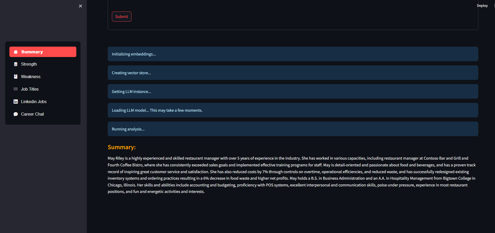
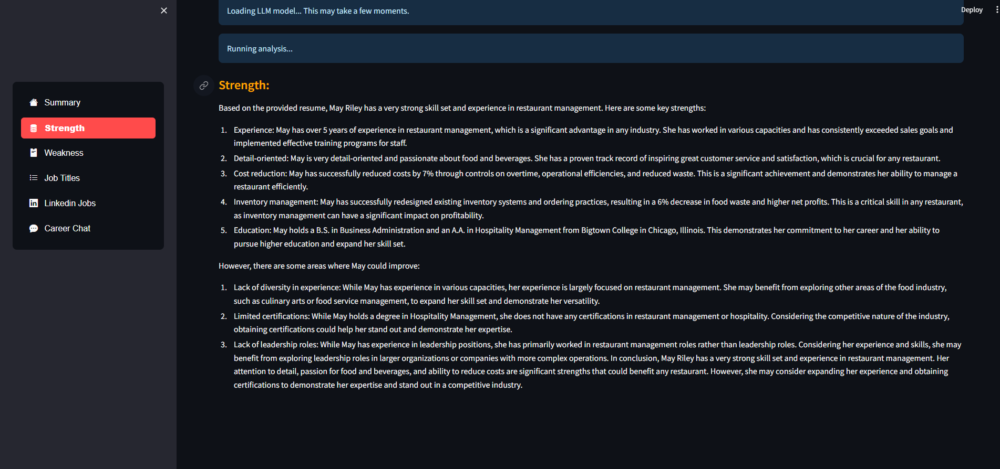
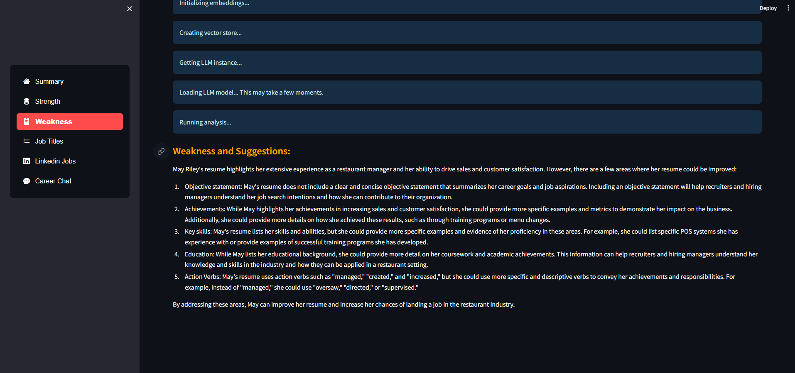
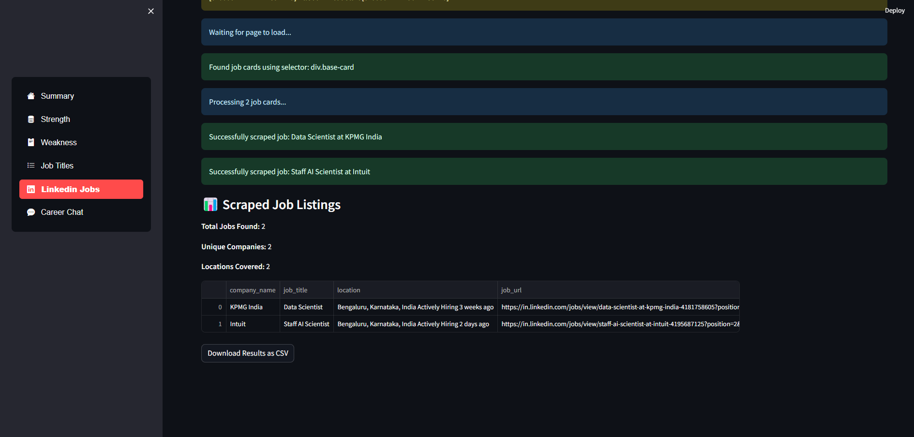
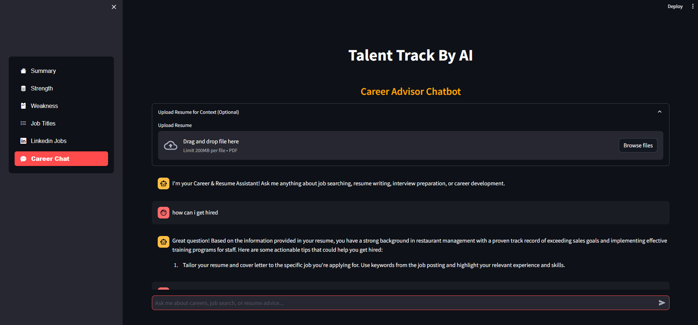

# Talent Track AI

## Website Preview  
Here’s a preview of the website interface:  

<p align="center">
  
  
  
  
   
</p>

## Overview
"Talent Track AI" leverages the power of LLM as an advanced Streamlit application, specializing in thorough resume analysis. It excels at summarizing the resume, evaluating strengths, identifying weaknesses, and offering personalized improvement suggestions, while also recommending the perfect job titles. Additionally, it seamlessly employs Selenium to extract vital LinkedIn data, encompassing company names, job titles, locations, job URLs, and detailed job descriptions. In essence, Resume Analyzer AI simplifies the job-seeking journey by equipping users with comprehensive insights to elevate their career opportunities.

## Features
- Resume Analysis
- LinkedIn Job Scraping
- Career Guidance
- Local LLM Processing (No API keys needed)

## System Requirements
- Python 3.8+
- 8GB+ RAM
- 10GB+ free disk space
- Multi-core CPU recommended

## Setup Instructions

1. Clone the repository:
```bash
git clone https://github.com/yourusername/TalentTrackAI.git
cd TalentTrackAI
```

2. Install required packages:
```bash
pip install -r requirements.txt
```

3. Download the model:
```bash
python setup_model.py
```

4. Run the application:
```bash
streamlit run app.py
```

## Key Components

### Local LLM Integration
- Uses Llama 2 7B Chat model (quantized version)
- Processes all requests locally
- No API keys or internet required for analysis
- Complete privacy and data security

### Resume Analysis Pipeline
- PDF text extraction
- Chunk-based processing
- Vector embeddings using HuggingFace
- FAISS for efficient similarity search
- Local LLM for analysis generation

### LinkedIn Integration
- Automated job search
- Real-time data extraction
- Customizable search parameters
- Detailed job information retrieval

## Usage Guide

1. **Resume Analysis**
   - Upload your resume (PDF format)
   - Get instant analysis including:
     - Detailed summary
     - Key strengths
     - Areas for improvement
     - Job title suggestions

2. **Job Search**
   - Enter desired job title
   - Specify location (optional)
   - View matching LinkedIn listings
   - Export results if needed

## Technical Details

### Model Specifications
- Model: Llama 2 7B Chat
- Format: GGUF (quantized)
- Context Window: 2048 tokens
- Memory Usage: ~4GB
- Processing: CPU-based

### Key Libraries
- Streamlit
- LangChain
- FAISS
- PyPDF2
- Selenium
- HuggingFace Transformers

## Performance Notes
- First run may take longer due to model loading
- Subsequent analyses are faster
- Processing time varies based on resume length
- RAM usage depends on concurrent operations

## Contributing
Contributions are welcome! Please feel free to submit a Pull Request.

## License
This project is licensed under the MIT License - see the LICENSE file for details.

<br />

**Table of Contents**

1. Key Technologies and Skills
2. Installation
3. Usage
4. Features
5. Contributing
6. License
7. Contact

<br />

**Key Technologies and Skills**
- Python
- NumPy
- Pandas
- LangChain
- LLM
- Selenium
- Streamlit
- Hugging Face
- AWS

<br />

**Usage**

To use this project, follow these steps:

1. Clone the repository:
```bash
git clone https://github.com/yourusername/TalentTrackAI.git
cd TalentTrackAI
```

2. Install the required packages: ```pip install -r requirements.txt```
3. Run the Streamlit app: ```streamlit run app.py```
4. Access the app in your browser at ```http://localhost:8501```

<br />

**Features**

**Easy User Experience:**
- Resume Analyzer AI makes it easy for users. You can upload your resume without any hassle. The application is designed to be user-friendly so that anyone can use its powerful resume analysis features.
- It also uses the PyPDF2 library to quickly extract text from your uploaded resume, which is the first step in doing a thorough analysis.

**Smart Text Analysis with Langchain:**
- What makes it special is how it analyzes text. It uses a smart method called the Langchain library to break long sections of text from resumes into smaller chunks, making them more meaningful.
- This clever technique improves the accuracy of the resume analysis, and it gives users practical advice on how to enhance their job prospects.

**Enhanced LLM Integration with FAISS:**
- The application uses local LLM processing for all analysis tasks, ensuring privacy and eliminating the need for API keys.
- It uses the FAISS(Facebook AI Similarity Search) library to convert both the text chunks and query text data into numerical vectors, simplifying the analysis process and enabling the retrieval of pertinent information.

**Intelligent Chunk Selection and LLM:**
- Utilizing similarity search, Resume Analyzer AI compares the query and chunks, enabling the selection of the top 'K' most similar chunks based on their similarity scores.
- The application processes all requests using a local LLM model, ensuring complete privacy and data security.

**Robust Question-Answering Pipeline:**
- This integration establishes a robust question-answering (QA) pipeline, making use of the load_qa_chain function, which encompasses multiple components, including the language model.
- The QA chain efficiently handles lists of input documents (docs) and a list of questions (chunks), with the response variable capturing the results, such as answers to the questions derived from the content within the input documents.

**Comprehensive Resume Analysis:**
- **Summary:** Resume Analyzer AI provides a quick, comprehensive overview of resumes, emphasizing qualifications, key experience, skills, projects, and achievements. Users can swiftly grasp profiles, enhancing review efficiency and insight.
- **Strength:** Effortlessly conducting a comprehensive resume review, it analyzes qualifications, experience, and accomplishments. It subsequently highlights strengths, providing job seekers with a competitive edge.
- **Weakness:** AI conducts thorough analysis to pinpoint weaknesses and offers tailored solutions for transforming them into strengths, empowering job seekers.
- **Suggestion:** AI provides personalized job title recommendations that align closely with the user's qualifications and resume content, facilitating an optimized job search experience.

<br />

**Selenium-Powered LinkedIn Data Scraping:**
- Utilizing Selenium and a Webdriver automated test tool, this feature enables users to input job titles, automating the data scraping process from LinkedIn. The scraped data includes crucial details such as company names, job titles, locations, URLs, and comprehensive job descriptions.
- This streamlined process enables users to easily review scraped job details and apply for positions, simplifying their job search and application experience.

<br />

**Contributing**

Contributions to this project are welcome! If you encounter any issues or have suggestions for improvements, please feel free to submit a pull request.

<br />

**License**

This project is licensed under the MIT License. Please review the LICENSE file for more details.

<br />

**Contact**

📧 Email: kirtanchaplot@gmail.com

For any further questions or inquiries, feel free to reach out. We are happy to assist you with any queries.

